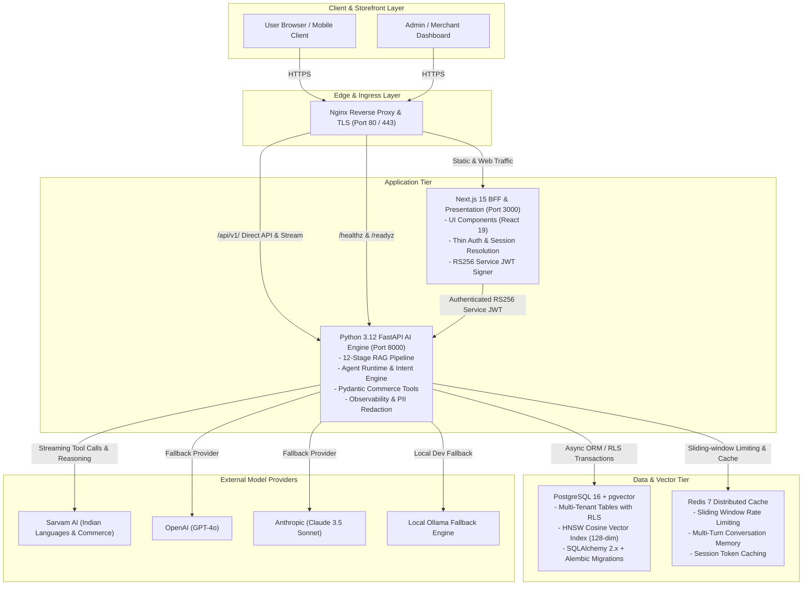
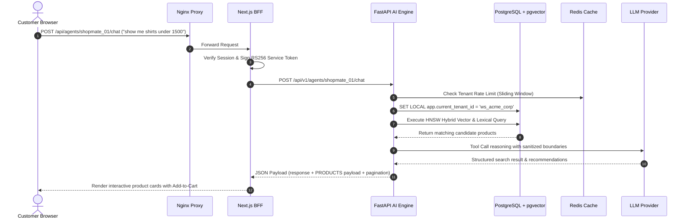

# ShopMate AaaS Enterprise Architecture

This document specifies the enterprise architecture of **ShopMate Agent-as-a-Service (AaaS)**, where Python (FastAPI) serves as the unified backend of record for all commerce, AI reasoning, 12-stage RAG, and data operations, while Next.js 15 acts as a high-performance presentation storefront and thin Backend-For-Frontend (BFF) proxy.

---

## 1. System Architecture Diagram

---

## 2. Component Responsibilities

### 2.1 Next.js 15 (Storefront & Thin BFF Proxy)
- **Zero Business Logic**: Contains no RAG retrieval, product ranking, constraint parsing, or direct database operations.
- **Asymmetric Service Authentication**: Signs short-lived asymmetric RS256 Service JWTs (`iss: aaas-node`, `aud: aaas-python`) to authenticate proxied merchant requests to FastAPI.
- **SSE Stream Forwarding**: Proxies FastAPI Server-Sent Events (`/api/v1/agents/{id}/chat/stream`) directly to React client components without buffering.

### 2.2 Python 3.12 FastAPI (Unified Backend of Record)
- **12-Stage Production RAG**:
  1. Lexical BM25 retrieval
  2. Dense vector embedding generation via `EmbeddingProvider`
  3. Hybrid weighted fusion scoring
  4. Prompt injection boundary defense (`<<<UNTRUSTED_CATALOG_DATA>>>`)
  5. Cross-encoder / reranking heuristics
  6. Contextual compression & token budget windowing
  7. Multi-tenant document isolation
  8. Recency & relevance decay
  9. Metadata filtering & taxonomy matching
  10. Strict tenant schema isolation
  11. Natural answer synthesis with verified citations
  12. Latency & trace observability
- **Pydantic Commerce Tools**:
  - `search_products`: Dynamic category, price bounds, gender, color, size, pagination.
  - `get_inventory`: Real-time stock levels with variant resolution.
  - `order_lookup` / `order_tracking`: Email-verified live order status.
  - `coupon_validation` / `apply_discount`: Promotion and discount rule validation.
  - `return_eligibility` / `create_return`: 30-day return policy and pickup scheduling.
  - `add_to_cart` / `cart_lookup`: Cart calculation, taxes, and shipping estimates.
  - `human_handoff`: Agent escalation to customer support representatives.
- **Tenant Isolation**:
  - Enforced per-request using Postgres Row-Level Security (`current_tenant_id`) and verified claims (`workspace_id`).
- **Observability**:
  - Structured JSON logging with request IDs, trace IDs, duration, and automatic PII redaction (masking emails, phones, cards, auth tokens).
  - Production probes: `/healthz` and `/readyz`.
  - Admin audit logging: `/api/v1/audit/logs`.

---

## 3. Data Flow Sequences

### 3.1 Shopper Conversational Search & Discovery Flow

---

## 4. Security Hardening & Zero-Trust Posture
1. **Asymmetric Service Authentication**: Node BFF signs using private RSA/EdDSA key (`SERVICE_JWT_PRIVATE_KEY`), FastAPI verifies using public key (`SERVICE_JWT_PUBLIC_KEY`).
2. **Postgres Row-Level Security (RLS)**: Mandatory `tenant_id` on all tenant tables (`agents`, `products`, `orders`, `knowledge_chunks`, `conversations`).
3. **No Secret Fallbacks**: All secret configurations fail closed at startup if missing or under 32 characters.
4. **PII Masking**: Customer emails, phone numbers, and payment cards are automatically redacted before log output.
5. **SSRF Guardrails**: Safe fetch blocks private IP ranges, cloud metadata endpoints (`169.254.169.254`), IPv6 loopbacks, and non-HTTP schemes.
